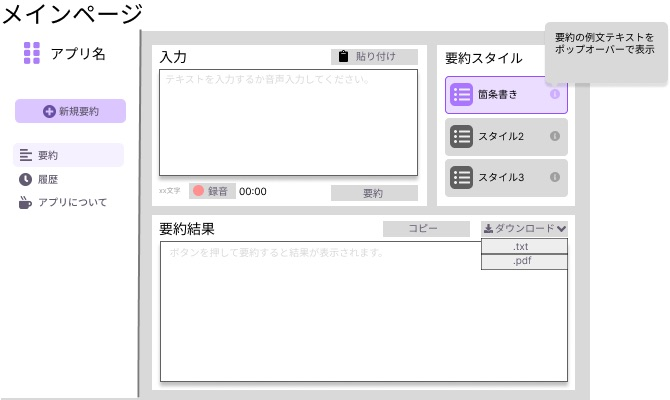
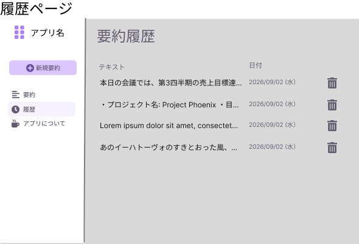

# Webアプリ画面設計

## 画面一覧

| path    | 画面名       | 内容                   |
| ------- | ------------ | ---------------------- |
| lp      | メインページ | 入力、文字起こし、要約 |
| history | 履歴ページ   | 過去の要約履歴の表示   |
| about   | Aboutページ  | アプリ情報およびライブラリ情報の表示 |

## ワイヤーフレーム

- [原案はGoogle StichのGemini 3 Flashで生成](https://stitch.withgoogle.com/projects/3631107852532038161)
- [下の画像はここ](https://www.figma.com/design/HadISp7mILQ9y12FlT21M4/psd2026-05?node-id=7-3&t=iDnCa2m8Epm5bL0z-1)
- 以下は枠組みのみを表したもので、実際にはライブラリのデザインで似たようなものをそのまま使う。
  - _nani gigantum umeris insidentes_

### メインページ

| 状態    | 表示内容                                                                                                                       | UI要素の変化                                                                                                                                                           |
| ------- | ------------------------------------------------------------------------------------------------------------------------------ | ---------------------------------------------------------------------------------------------------------------------------------------------------------------------- |
| Idle    | 入力も出力もプレースホルダが表示されている。                                                                                   | 全てのUI要素が有効                                                                                                                                                     |
| Loading | 録音中：ストップウォッチが0にリセットされ、時間を測り始める 要約中：                                                        | 録音中：要約ボタンが無効になる 要約中：録音ボタン・貼り付けボタン・ダウンロードボタンが無効になる。要約ボタンをスピナーにする。入力テキストエリアを入力不可にする   |
| Success | 録音後：ストップウォッチが録音秒数を表示し続け、入力の最後の行に文字起こしが追記される 要約後：要約結果に応答が表示される。 | 録音後：要約ボタンが有効に戻る 要約後：録音ボタン・貼り付けボタン・ダウンロードボタンが有効になる。要約ボタンのスピナーが消える。入力テキストエリアを入力可能に戻す |
| Error   | 録音後：ストップウォッチの部分に赤文字で「エラー」と表示する 要約後：要約結果にエラーの旨を表示する                         | Successの時と同じ                                                                                                                                                      |

### 履歴ページ

| 状態    | 表示内容                                                                                                                      | UI要素の変化 |
| ------- | ----------------------------------------------------------------------------------------------------------------------------- | ------------ |
| Idle    | 過去の要約履歴がリストで表示される。履歴が0件の場合、薄い色の文字で「履歴はありません」と表示する。履歴は無限スクロールする。 |              |
| Loading | 削除時：削除の確認モーダルを表示後、リストから削除される クリック時：ページ遷移する                                        |              |
| Success | 削除時：リストから削除される クリック時：要約ページに過去の要約内容がそのまま入力された状態で遷移                          |              |
| Error   | トーストか通知で削除失敗の旨を表示                                                                                            |              |
