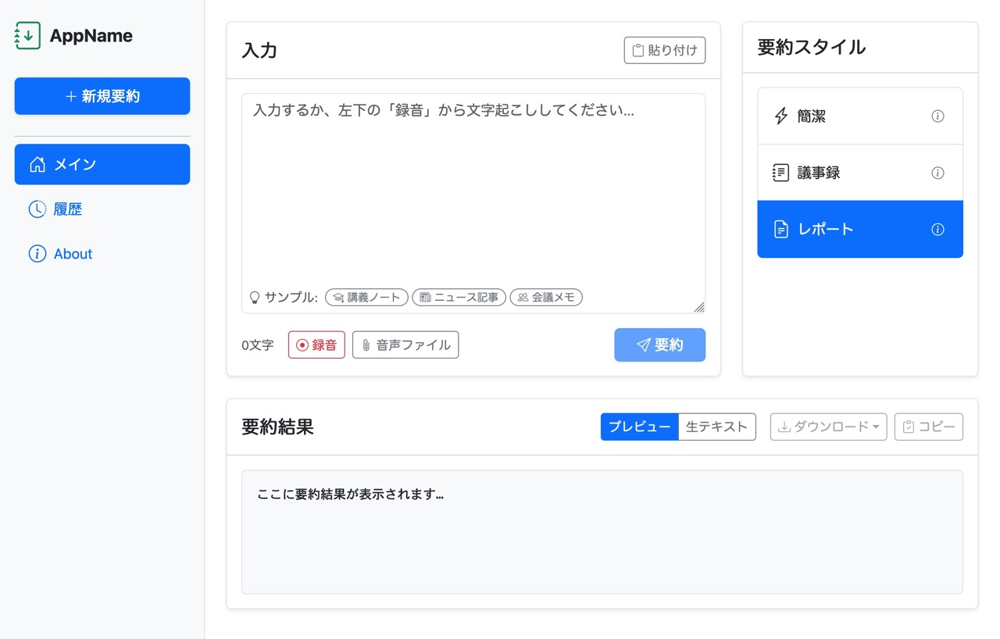
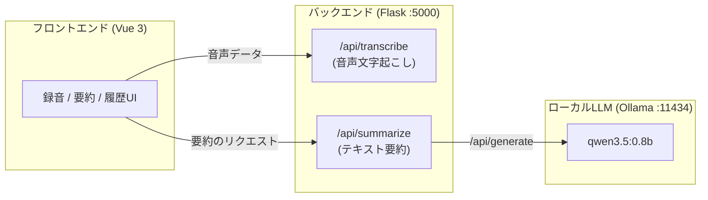

# OtoMatome : 生成AI活用サンプルアプリ

OtoMatomeは、生成AI（LLM）を活用した音声入力の要約・整理ができる、ブラウザ上で動作するアプリケーションです。




## 📖ドキュメント

- [仕様書（design-document.md）](./design-document.md): 機能要件・実装状況・入出力例・開発フロー・APIエンドポイント仕様
- [画面設計（design-document-page.md）](./design-document-page.md): 画面遷移・UIワイヤーフレーム・状態遷移
- [テスト仕様（test-spec.md）](./test-spec.md): 機能検証・APIテスト

# 🔧実行方法（開発用）

> [!NOTE]  
> Requirements:
>
> - Git
> - Python >= 3.13
> - Ollama

```sh
# 1. Clone
git clone https://github.com/mie-u-psd-2026/mu-psd05
cd mu-psd05

# 2. Ollamaをバックグラウンド起動する
## （Windows）
start /b "" ollama serve >NUL 2>&1

## バックグラウンドで起動する（Linux/macOS）
ollama serve >/dev/null 2>&1 &

# （初回のみ）使用モデル等のインストール
ollama pull qwen3.5:0.8b
pip install -r backend/requirements.txt # uvやvenvを使用しても良い

# 3. 開発サーバの開始
python backend/app.py
```

[`http://localhost:5000/`](http://localhost:5000/)にアクセスすると、アプリが表示されます。

> [!CAUTION]  
> 開発サーバは[本番環境で使わないでください](https://flask.palletsprojects.com/en/stable/server/)。

# 📥環境構築

## 開発ツールインストール

**🧰ツール一覧：**

- [Visual Studio Code](https://code.visualstudio.com/)
- [Python](https://www.python.org/)
- [OpenCode](https://opencode.ai/ja)
- [Ollama](https://ollama.com/)

### Windows

- 管理者権限でコマンドプロンプトを起動します。
- 以下のコマンドを実行し、`winget`で必要なソフトウェアを入手します。

```pwsh
winget install --id Microsoft.VisualStudioCode -e --source winget --accept-package-agreements --accept-source-agreements
winget install --id Python.Python.3.13 -e --source winget --accept-package-agreements --accept-source-agreements
winget install --id SST.opencode -e --source winget --accept-package-agreements --accept-source-agreements
winget install --id Ollama.Ollama -e --source winget --accept-package-agreements --accept-source-agreements
```

### macOS

- [Homebrew](https://brew.sh/ja/)等、パッケージマネージャを使用してインストールしてください。以下はHomebrewの例です。

```sh
brew install -y visual-studio-code python@3.13 opencode ollama
```

> [!TIP]  
> Pythonの管理にuvを使用する場合、`uv pin python 3.13`で特定のバージョンをインストールすることなくプロジェクトで使用するPythonバージョンを固定できます。

## VSCode拡張機能

- VSCodeを起動し、左部アクティビティバーの「拡張機能」から、以下をインストールしてください。
  - Python
  - Vue.js Extension Pack

## 環境セットアップ

### Python ライブラリインストール

- 以下のコマンドで使用するPythonライブラリをインストールします。

```bash
pip install -r requirements.txt
```

### 言語モデルダウンロード

- `ollama serve`コマンドでOllamaを起動中に、別のターミナルで次のコマンドを実行してモデルを追加します。

```sh
ollama pull qwen3.5:0.8b
```

- モデルを削除するには次のようにします。

```sh
$ ollama ls
NAME                                        ID              SIZE      MODIFIED
gemma4:e2b                                  7fbdbf8f5e45    7.2 GB    29 hours ago
qwen3.5:4b-q4_K_M                           2a654d98e6fb    3.4 GB    29 hours ago
qwen3.5:2b-q4_K_M                           124a03c34777    1.9 GB    29 hours ago
qwen3.5:0.8b                                f3817196d142    1.0 GB    8 days ago
$ ollama rm qwen3.5:4b-q4_K_M
deleted 'qwen3.5:4b-q4_K_M'
```

> [!TIP]  
> モデルは一つで1GB〜15GB程度の容量を使用します。必要がなくなったら削除すべきでしょう。

# 🏗️ アーキテクチャ構成

- フロントエンド: Vue.jsとBootstrapのCDN版を用いています。
- バックエンド: Python, Flask, faster-whisperを用いています。Ollama APIを使ってローカル起動のOllamaを叩いています。



# 📚開発の参考資料

## ローカルの Ollama を使う場合（低性能だが利用制限なし）：

- VSCode上でターミナルを開いて、以下を入力します。

```sh
ollama launch opencode --model=qwen3.5:0.8b
```

## クラウドの無料モデルを使う場合：(中性能、無料枠少ない)

- VSCode上でターミナルを開いて、 `opencode` と入力し、実行します。
- /models と入力し、Free 表示のあるモデルを選択します。（例: DeepSeek V4 Flash Free）

## Google AI Studioを使う場合:(高性能、無料枠多い)

- [Google AI Studio](https://aistudio.google.com/api-keys)を開きます。
- APIキーを作成、を押下し、キー名を適当に命名し、プロジェクトを新規作成します。

- APIキーが表示されるので、クリップボードにコピーしておきます。

- [プロジェクト一覧](https://aistudio.google.com/projects)を開き、新規作成したプロジェクトが無料枠となっていることを確認します。

- VSCode上でターミナルを開いて、 `opencode` と入力します。

- /connect と入力、プロバイダ一覧が表示されるので、Googleを選択、APIキーに先ほどのAPIキーを貼り付けます。

# 🤖AIを用いたコード修正

- opencodeに修正を依頼してみてください。（例：猫語で回答するボタンを追加して ）

- フロントエンド担当者は、html/JavaScriptを追加／修正して画面を構築してください。

- バックエンド担当者は、app.py上にURLとAPIを作成してください。

# 📚🔗参考リンク

- [Flask](https://flask.palletsprojects.com/en/stable/)
  - Python で書かれた Webアプリケーションサーバ
- [Vue.js](https://vuejs.org/)
  - JavaScript製製のWebフロントエンド フレームワーク
- [Vue.js Tutorial](https://ja.vuejs.org/tutorial/)
  - Vue.jsの入門用チュートリアル
- [Vue Router](https://router.vuejs.org/guide/)
  - SPAを構築するための公式プラグイン
- [Bootstrap](https://getbootstrap.jp/docs/5.3/getting-started/introduction/)
  - UIを作成するたえのフロントエンドツールキット
- [OpenAI API](https://github.com/openai/openai-python)
  - Pythonから、OpenAI APIを呼び出すライブラリ
- [Ollama API(`/api/generate`)](https://docs.ollama.com/api/generate)
  - OllamaのNative APIで一回きりのテキストを生成するAPI
