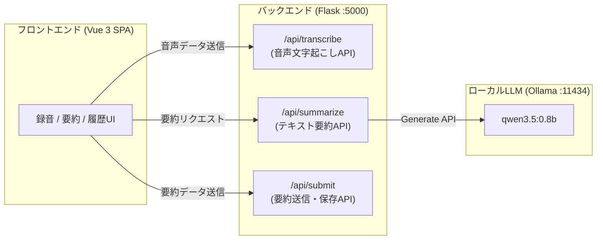

# OtoMatome : 生成AI活用サンプルアプリ

OtoMatomeは、生成AI（LLM）を活用した音声入力の要約・整理ができる、ブラウザ上で動作するアプリケーションです。


## 📖ドキュメント

- [仕様書（design-document.md）](./design-document.md): 機能要件・APIエンドポイント仕様
- [画面設計（design-document-page.md）](./design-document-page.md): 画面遷移・UIワイヤーフレーム・状態遷移
- [テスト仕様（test-spec.md）](./test-spec.md): 機能検証・APIテスト

# 🏗️ アーキテクチャ構成

- フロントエンド: Vue.jsとBootstrap 5.3のCDN版を用いています。
- バックエンド: Python, FlaskとOllama APIを用いてローカル起動のOllamaを叩いています。



# 🔧実行方法（開発用）

Requirements:

- Git
- Python >= 3.13
- Ollama

### 1. リポジトリをclone

```sh
git clone https://github.com/mie-u-psd-2026/mu-psd05
cd mu-psd05
```

### 2. Ollamaを起動し、モデルをダウンロード

Ollamaのサーバーを起動します。

```sh
ollama serve
```

起動したOllamaを残したまま、ターミナル等で別タブを開くなどして、別のセッションでモデルをダウンロードします。

```sh
ollama pull qwen3.5:0.8b
```

### 3. Pythonに必要ライブラリを追加

Pythonの仮想環境を`./.venv`に作成します。

```sh
python -m venv .venv
```

以下のコマンドを使って、Python仮想環境(venv)を有効化します。

- macOS / Linux: `source .venv/bin/activate`
- Windows (コマンドプロンプト): `.venv\Scripts\activate.bat`
- Windows (PowerShell): `.venv\Scripts\Activate.ps1`

必要なPythonライブラリをインストールします。

```sh
pip install -r requirements.txt
```

### 4. Flaskの開発サーバを起動

次のコマンドを実行し、開発サーバを起動します。

```sh
python backend/app.py
```

ブラウザで[`http://localhost:5000/static/index.html`](http://localhost:5000/static/index.html)にアクセスすると、ページが表示されます。

> [!CAUTION]
> 開発サーバは[本番環境で使わないでください](https://flask.palletsprojects.com/en/stable/server/)。

# 🧰開発環境

- [Visual Studio Code](https://code.visualstudio.com/)
- [OpenCode](https://opencode.ai/ja)
- [Ollama](https://ollama.com/)
- [Python](https://www.python.org/)

# 📥環境構築

## 開発ツールインストール

### Windows

- 管理者権限でコマンドプロンプトを起動します。
- 以下のコマンドを実行し、`winget`で必要なソフトウェアを入手します。

```pwsh
winget install --id Microsoft.VisualStudioCode -e --source winget --accept-package-agreements --accept-source-agreements
winget install --id Python.Python.3.13 -e --source winget --accept-package-agreements --accept-source-agreements
winget install --id SST.opencode -e --source winget --accept-package-agreements --accept-source-agreements
winget install --id Ollama.Ollama -e --source winget --accept-package-agreements --accept-source-agreements
start /b ollama serve > NUL 2>&1
timeout /t 3 /nobreak > NUL
ollama pull qwen3.5:0.8b
```

- vscodeを起動し、アクティビティバーの拡張機能から、以下のプラグインをインストールしてください。
  - Python
  - Vue.js Extension Pack

### macOS

[Homebrew](https://brew.sh/ja/)などのパッケージマネージャを使用して必要なソフトをインストールしてください。

```sh
brew install -y visual-studio-code python@3.13 opencode ollama
ollama serve &
ollama pull qwen3.5:0.8b
```

（Pythonはuvを使用して`uv pin python 3.13`も可）

## 環境セットアップ

### Python ライブラリインストール

以下のコマンドでPythonの利用ライブラリをインストールします。

```bash
pip install -r requirements.txt
```

あるいは、`uv`を使うこともできます。

```sh
uv venv
uv pip install -r requirements.txt
```

# 📚開発の参考資料

## ローカルの Ollama を使う場合（低性能だが利用制限なし）：

- VSCode上でターミナルを開いて、以下を入力します。

```sh
ollama launch opencode --model=qwen3.5:0.8b
```

## クラウドの無料モデルを使う場合：(中性能、無料枠少ない)

- VSCode上でターミナルを開いて、 `opencode` と入力し、実行します。
- /models と入力し、Free 表示のあるモデルを選択します。（例: DeepSeek V4 Flash Free）

## Google AI Studioを使う場合:(高性能、無料枠多い)

- [Google AI Studio](https://aistudio.google.com/api-keys)を開きます。
- APIキーを作成、を押下し、キー名を適当に命名し、プロジェクトを新規作成します。

- APIキーが表示されるので、クリップボードにコピーしておきます。

- [プロジェクト一覧](https://aistudio.google.com/projects)を開き、新規作成したプロジェクトが無料枠となっていることを確認します。

- VSCode上でターミナルを開いて、 `opencode` と入力します。

- /connect と入力、プロバイダ一覧が表示されるので、Googleを選択、APIキーに先ほどのAPIキーを貼り付けます。

# 🤖AIを用いたコード修正

- opencodeに修正を依頼してみてください。（例：猫語で回答するボタンを追加して ）

- フロントエンド担当者は、html/JavaScriptを追加／修正して画面を構築してください。

- バックエンド担当者は、app.py上にURLとAPIを作成してください。

# 🚧実装状況と今後の課題

- **フロントエンド実装**:
  - [x] Vue Routerによるマルチビュー構成（Home / History / About）
  - [x] MediaRecorderによる音声録音・タイマー計測UI
  - [x] 3種類の要約スタイル切り替え（簡潔・会議録・レポート）
  - [x] LocalStorage永続化（要約履歴の復元・個別削除）
  - [x] トースト通知・テキストファイルダウンロード・印刷レイアウト
  - [ ] 内容からカレンダーの予定の生成
  - [ ] 文字起こしのリアルタイム表示
- **バックエンドAPI実装**:
  - [x] `/api/transcribe`: 音声受付・文字起こしエンドポイント
  - [x] `/api/summarize`: 要約プロンプト生成・Ollama連携
  - [x] `/api/submit`: 要約データ送信受付
  - [ ] `services/transcription.py`: Whisper等による実音声文字起こしの実装
  - [ ] `/api/submit`: （実装するか未定）SQLite等を用いた要約履歴のサーバーサイドDB永続化

# 📚🔗参考リンク

- [Flask](https://flask.palletsprojects.com/en/stable/)
  - Python で書かれた Webアプリケーションサーバ
- [Vue.js](https://vuejs.org/)
  - JavaScript製製のWebフロントエンド フレームワーク
- [Vue.js Tutorial](https://ja.vuejs.org/tutorial/)
  - Vue.jsの入門用チュートリアル
- [Vue Router](https://router.vuejs.org/guide/)
  - SPAを構築するための公式プラグイン
- [Bootstrap](https://getbootstrap.jp/docs/5.3/getting-started/introduction/)
  - UIを作成するたえのフロントエンドツールキット
- [OpenAI API](https://github.com/openai/openai-python)
  - Pythonから、OpenAI APIを呼び出すライブラリ
- [Ollama Python Library](https://github.com/ollama/ollama-python)
  - PythonからOllamaのNative APIを呼び出すライブラリ
